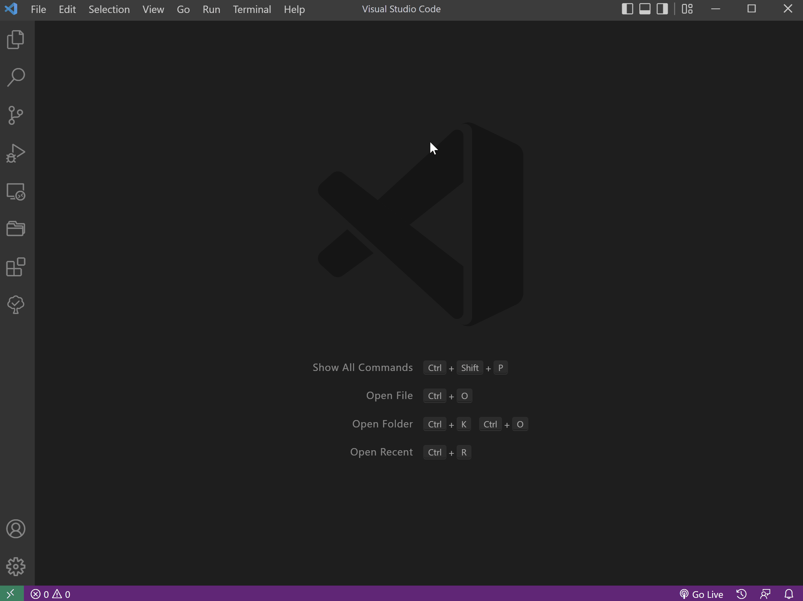
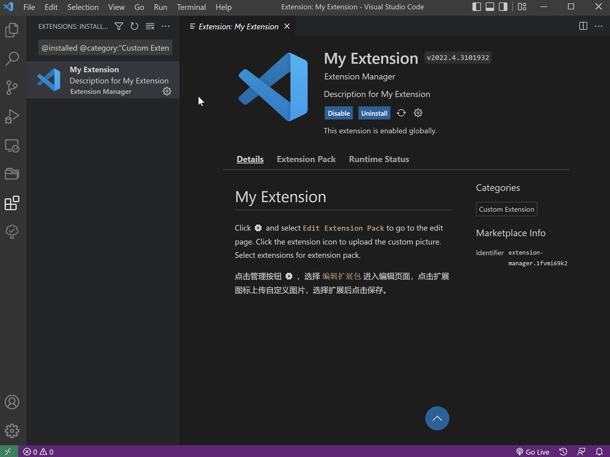

English | [简体中文](README.zh-CN.md)

# Extension Manager

Quickly enable different extensions in different workspaces by creating extension packages.

`Extension Manager` can quickly create an extension package and edit the included extensions.

The following commands can be used:

- `Extension: Create New Custom Extension Pack` Create custom extension packs
- `Extensions: View Custom Extension Pack` Show custom expansion packs

