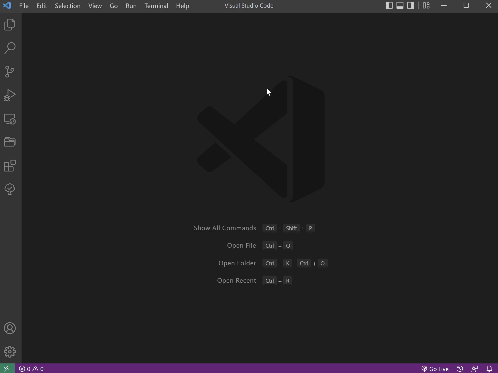
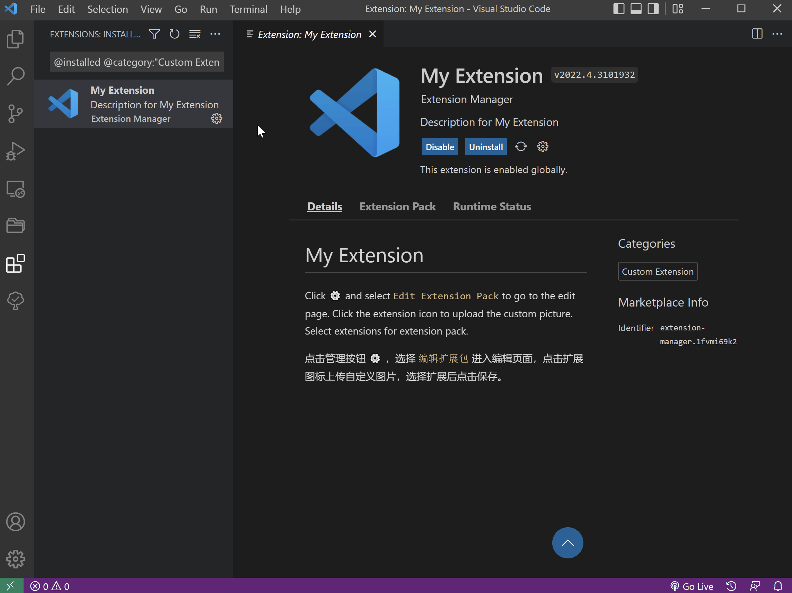

[English](README.md) | 简体中文

# Extension Manager

通过创建扩展包的方式实现在不同工作空间中快速启用不同的扩展。

`Extension Manager` 能够快速创建一个扩展包，并编辑包含的扩展。

可以使用以下命令：

- `Extension: Create New Custom Extension Pack` 创建自定义扩展包
- `Extensions: View Custom Extension Pack` 显示自定义扩展包

